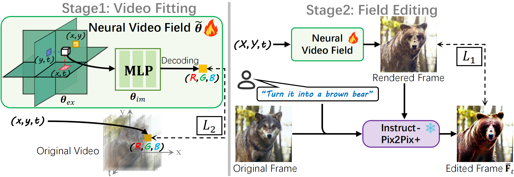
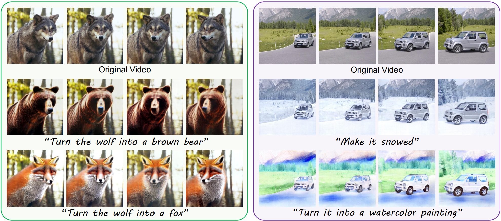

<!-- <h1>NVEdit</h1> -->
<h3>Neural Video Fields Editing</h3>

[Shuzhou Yang](https://ysz2022.github.io/)1,2, [Chong Mou](https://scholar.google.com/citations?user=SYQoDk0AAAAJ&hl=zh-CN&oi=ao)1, [Jiwen Yu](https://vvictoryuki.github.io/website/)1, Yuhan Wang1,2, [Xiandong Meng](https://orcid.org/0000-0002-1295-769X)2, [Jian Zhang](https://jianzhang.tech/)1*

1 SECE, Peking University, 2 Peng Cheng Laboratory

## Introduction

Diffusion models have revolutionized text-driven video editing. However, applying these methods to real-world editing encounters two significant challenges: (1) the rapid increase in graphics memory demand as the number of frames grows, and (2) the inter-frame inconsistency in edited videos. To this end, we propose **NVEdit**, a novel text-driven video editing framework designed to mitigate memory overhead and improve consistent editing for real-world long videos. Specifically, we construct a neural video field, powered by tri-plane and sparse grid, to enable encoding long videos with hundreds of frames in a memory-efficient manner. Next, we update the video field through off-the-shelf Text-to-Image (T2I) models to impart text-driven editing effects. A progressive optimization strategy is developed to preserve original temporal priors. Importantly, both the neural video field and T2I model are adaptable and replaceable, thus inspiring future research. Experiments demonstrate that our approach successfully edits hundreds of frames with impressive inter-frame consistency.

## Results

**NVEdit** enables various editing options, including shape variation, scene change, and style transfer, while preserving the motion and semantic layout of the original scene. Due to its efficient encoding rate, long videos with hundreds of frames even be edited well. More results can be found in our [**Home Page**](https://nvedit.github.io/).

## Code

Our code is coming soon……
