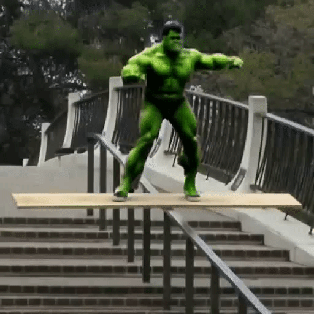
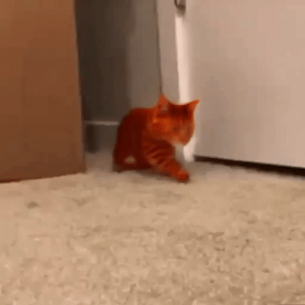
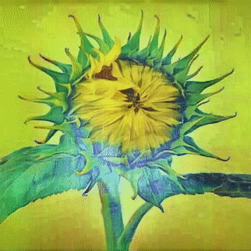

<h3>Neural Video Fields Editing</h3>

[Shuzhou Yang](https://ysz2022.github.io/)1,2, [Chong Mou](https://scholar.google.com/citations?user=SYQoDk0AAAAJ&hl=zh-CN&oi=ao)1, [Jiwen Yu](https://vvictoryuki.github.io/website/)1, Yuhan Wang1,2, [Xiandong Meng](https://orcid.org/0000-0002-1295-769X)2, [Jian Zhang](https://jianzhang.tech/)1*

1 SECE, Peking University, 2 Peng Cheng Laboratory

**TL;DR: Editing long videos coherently via neural video fields.**

## Gallery

We have showcased some video editing results of **NVEdit** on real-world videos below.

More results can be found on our [**Project Page**](https://nvedit.github.io/).

<table>
  <tr>
    <td></td>
    <td></td>
    <td></td>
    <td></td>
    <td></td>
    <td></td>
  </tr>
  <tr>
    <td colspan="2">
"Make it snowed"
</td>
    <td colspan="2">
"Give him a mustache"
</td>
    <td colspan="2">
"Turn the wolf into a brown bear"
</td>
  </tr>
  <tr>
    <td></td>
    <td></td>
    <td></td>
    <td></td>
    <td></td>
    <td></td>
  </tr>
  <tr>
    <td colspan="2">
"Make it autumn"
</td>
    <td colspan="2">
"Turn his shirt pink"
</td>
    <td colspan="2">
"Turn it into Monet style"
</td>
  </tr>
  <tr>
    <td></td>
    <td></td>
    <td></td>
    <td></td>
    <td></td>
    <td></td>
  </tr>
  <tr>
    <td colspan="2">
"Turn him into the Hulk"
</td>
    <td colspan="2">
"Turn it into a ginger cat"
</td>
    <td colspan="2">
"Turn it into Van-Gogh style"
</td>
  </tr>
</table>

## Code

Our code is coming soon……
